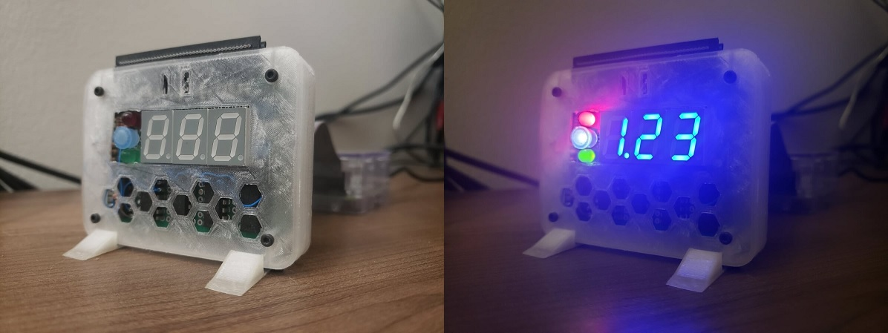

# BaseStation

This is a toy project I made from scratch: a little 7-segment LED module for my Raspberry Pi that displays arbitrary strings and numbers.



I felt like dusting off my electrical engineering diploma, so I dug around in my parts box and found some 7-segment LEDs and decided to do something with them.

I only had three of them but my design accommodates a fourth if I ever decide to fill it in.

## Circuit

I've lost my hand-drawn schematics but I still have the wiring diagram and part list.


My image editor (Google Draw) made it easier to see through the mess of wires on the bottom right by selecting any particular wire and seeing a clear outline of it; this of course doesn't show in the above SVG.

### Parts

* 7-segment display: LTS5501AB (qty. 3)
* LED driver/shift register combo: TLC5916 (qty. 4)
* Level shifter: CD4504B (qty. 1)
* 3.9 kOhm resistor (`Rext`), to control the default sink current for the LED drivers (qty. 4)
* 600 Ohm resistor, to sink some current from the standalone white LED because it's painfully bright otherwise (qty. 1, which I approximated with two 1 kOhms in parallel and a 100 Ohm in series)
* I don't know what the standalone LEDs are.
  They'd been in my box for 11 years.
* 2x20 0.100" GPIO pin header
* Prototype PCB, 24 holes by 18 holes

### Design choices

I already had a Raspberry Pi which is meant for this kind of hobbying so it was logical to use that.
I also had some Arduinos laying around that I could have used, but I wanted to entertain the possibility of driving the module with some kind of web service (e.g. to show the outdoor temperature or something) so I went with the Pi.
I find it more fun to develop on anyway.

The shift-register LED drivers seemed like a convenient choice: there aren't _that_ many GPIO pins and, in the spirit of future-proofing, what if I want to connect twice as many LEDs someday? Or connect something else to my Pi's GPIO header that has nothing to do with this module?

The combination shift register, 8x parallel LED current sink, and daisy chain serve to simplify my circuit just about as much as possible.

Each driver supports up to eight LEDs, which meshes well with each 7-segment display actually having _eight_ individual LEDs (there's an extra one for the decimal dot).

Despite having only three 7-segment LEDs, I designed for four of them just in case I want to add a fourth in the future.
And despite only needing only a handful of the GPIO pins, I'm using a full 40-pin ribbon cable because I had one sitting around and it's more convenient than hacking together something custom.

I wanted to be able to indicate a negative sign for numbers with three significant figures, but due to not having a fourth display I threw some spare LEDs into the empty spot for it.
I had red, green and white LEDs, but I wanted the white one to be blue to match the colour of the displays -- so I glued a blue pen cap to it.

The 3.3V supply isn't enough for the forward voltage of the LEDs so they're powered off 5V.
I experimented and found that 5 mA per LED was plenty bright while falling well below the maximum allowed power on 5V.

I'm using 5V logic as well, hence the level shifter.
3.3V may have worked, and it would have simplified the circuit quite a bit, but I still went with 5V for a couple reasons:

* It's difficult to find official specifications for the power supplies on the Raspberry Pi.
  I found some sources saying 3.3V can only supply 30 mA and other sources saying it can supply over 1 A, without qualifying how much can come from the supply rail and how much can come from the GPIOs themselves (I was not planning on driving any LEDs directly from the GPIOs).
* On one hand, the non-LED current sinks in my circuit are just the drivers themselves.
  The datasheet doesn't say how much current it draws for my choice of `Rext`, but I can reasonably assume from the numbers they do provide that each driver uses no more than 10 mA.
  Four drivers each taking up to 10 mA when some sources say I can't use more than 30 mA on the 3.3V rail leaves ample room for doubt.
* On the other hand, the 5V supply powers the external USB ports directly so at a minimum I can expect to get 500 mA from them (and many sources say you can in fact get over 1 A).
  Even with up to 32 LEDs turned on all at once, there's plenty of room left over for the rest of the circuit.

If I go with 5V, at worst I over-design the circuit with a level shifter I might not need.

If I go with 3.3V, at worst my Raspberry Pi melts because it can't supply enough current and I have to re-design the circuit and re-solder an already very fiddly little circuit board.

In the absence of reliable power specifications, I went with the safer option.

## Software

I chose C# and .NET because
* I wanted to use a familiar language
* I wanted to experiment with [.NET Core on ARM](https://www.hanselman.com/blog/remote-debugging-with-vs-code-on-windows-to-a-raspberry-pi-using-net-core-on-arm)

I wrote a quick-and-dirty prototype back in 2019 when I started the project and left it like that.
When I came back I realized I wanted more flexibility so I made it into a CLI app.

Overall I'm pleased with how it turned out, but it wasn't without trade-offs:
* Getting the edit-build-publish-debug cycle working right in Visual Studio Code is painful, even more so after letting this project sit for over a year and then coming back to it.
  OmniSharp in particular has some rather unhelpful error messages.
* The startup time for my program is several seconds longer than I'd like.
  I haven't looked into optimizing it but I'm sure it could be done -- I imagine it'll just bring more pain to the already complicated setup.
  A REPL may have been a better choice as I imagine most of the startup time comes from loading the bajillions of .NET Core libraries.

### IGpioController

The lowest level of the program is `IGpioController`, which just wraps `System.Devices.Gpio.GpioController`.
This provides direct access to the GPIO pins which I've wired to the first LED driver/shift register.

I'm only using four GPIO lines:
* GPIO 22 (Data)
* GPIO 23 (Clock)
* GPIO 24 (Latch)
* GPIO 25 (Enable)

I did not connect the output of the daisy chain to GPIO; aside from chaining onto the next chip (of which there are only finitely many) it is only used for fault detection.
Although, connecting it and reading from it would allow you to read back the values you've previously written to the registers.
This would permit a useful system self-test: write 32 random bits and read them all back a bunch of times to help ensure your circuit works right.
Maybe a project for another day!

### LedDriver

`LedDriver` is the next abstraction above `IGpioController`: it converts bits and bytes into data/clock/latch/enable pulses.
It is `IDisposable` because it takes ownership of those four pins while it's alive.
Dispose it to release the pins.

Each of the 7-segment LEDs is wired to its own LED driver; one bit from the driver corresponds to one bit of the LEDs. The following diagram shows the bit mapping:

```
        4
     -------
    |       |
 3  |       |  5
    |   7   |
     -------
    |       |
 2  |       |  6
    |   1   |
     ------- o 0
```

The most recent bit shifted into the register outputs to line 0 (the lower-right dot), so to get `4` on the display you have to push these bits in order from left to right: `1, 1, 1, 0, 1, 0, 0, 0`.

To avoid output glitches, most shift registers (including this one) support a "latch" buffer between the internal registers and the output pins.
This allows you to buffer an entire frame of arbitrarily many bits on your daisy chain, and have them all take effect simultaneously with a single latch pulse.

Use `LedDriver.WriteBit` to write each bit, and then `LedDriver.Latch` to latch them to the output.

The standalone colour LEDs are wired to bits `0=red`, `1=blue`, `2=green`.
The upper five bits of that shift register are not connected, however you're still required to push a full eight bits in order to complete the daisy chain.

In order of appearance in the daisy chain, the shift register for the standalone LEDs comes first; then the 7-segment display on the left; then the one in the middle; and finally the one on the right.
So when pushing a full 32 bit frame, the first bit pushed will drive the middle "hyphen" segment of the right-most display; the 25th through 29th bits will drive the empty lines on the standalone shift register; and the last bit pushed will drive the red LED.

### DisplayCharacter

A `DisplayCharacter` is a fancy byte wrapper representing the state of a single 7-segment display unit.
It supports construction from a subset of alphanumeric characters.

Not all letters and cases are implemented because they can't really be displayed on a 7-segment display (`M` and `W` in particular).
These show up as question marks (without the dot because the dot LED is on the wrong side!).

### DisplayFrame

A `DisplayFrame` represents the state of the entire set of shift registers. It is just a composition three `DisplayCharacter`s for the 7-segment displays and three `<StatusLed, bool>` pairs for the standalone LEDs.

`DisplayFrame` and `DisplayCharacter` are immutable: if they were mutable, then the API would suggest that simply modifying any of those values would reflect immediately on the physical device, and that would be more tricky to get right in the implementation.
Instead, you're expected to construct and push full frames as units to the `DisplayDriver`.
If you need to toggle status LED or change a digit, create a new frame from the previous one and push the result.

To make the API a bit more fluent, you can create new `DisplayFrame`s by applying modifications to existing ones using the various `With` APIs: `WithCharacter`, `WithPushedCharacter` and `WithStatus`.

### DisplayDriver

`DisplayDriver` sits above `LedDriver`: it takes `DisplayFrame`s and pushes the right bits in the right order to an `LedDriver`.

Because the main use case is displaying simple strings and numbers, `DisplayDriver` also has some extension methods for directly displaying those things so that you don't have to manually create a bunch of temporary `DisplayFrame`s.
